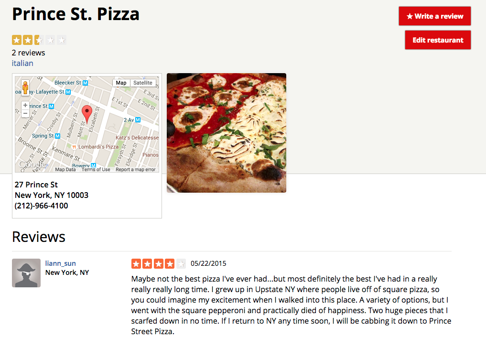

# [welp.space](welp.space)

Welp is a Yelp clone written primarily in Backbone and Rails. [Check it out live!](welp.space)

### Highlights

* Uses subviews in Backbone to render views with listeners in order to prevent re-rendering the entire page upon the completion of `GET` requests.
* Custom authentication using BCrypt overrides User#passsword= method to store secret hash instead of plain text.
* Uses Google Maps in both the front and back end. The app geocodes addresses in Rails in order to pass coordinates to Backbone through a custom API. Then, it uses said coordinates to build a `google.maps.Marker` for each restaurant.
* OAuth allows users to sign in with Twitter through allowing User instances to store either a username and password  or a provider and secret ID.
* Uploads images to Amazon S3 with Rails validations. Custom jbuilder templates ensure that `GET` requests only return image URLs as opposed to entire images.

### TODO
* Add the ability to search for restaurants based on an address using an asynchronous Google Geocoding API request in Backbone.
* Permit users to use some website features without logging in.
* Permit authentication through Facebook and Google+.
* Make design responsive to screen sizes using CSS breakpoints.
* Create a newsfeed of users' actions on their homepages.
